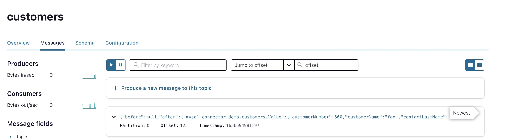
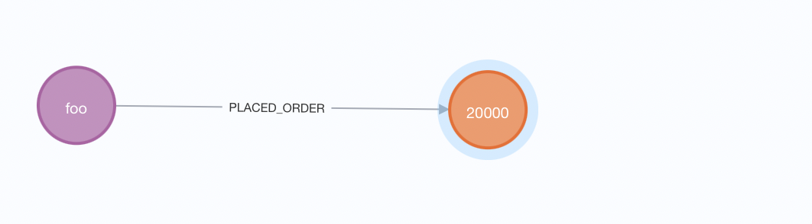

== Change Data Capture With Kafka From MySql to Neo4j

This demo will show you how you can create a Change Data Capture (CDC) architecture with Kafka, to migrate the data and its changes from MySql (or a different relational database supported from Debezium) to Neo4j. The stack for this demo is as follows:

. A MySql instance, that will be the start of our event stream;
. Our first Kafka Connect instance with the Debezium Plugin, that will read the binlog of the database and stream the events that occur in the database;
. A Kafka instance, to manage the messages created from Debezium;
. Our second Kafka Connect instance with the Neo4j Plugin, that will stream the messages from Kafka to the Neo4j instance, running, for each specified topic, a certain query to manage the possible types of operation that can occur in the MySql database: _c_ (create), _r_ (read), _u_ (update), _d_ (delete);
. A Neo4j instance, that will be the end point of our event stream.

We will also need, to run Kafka and use the Avro message format, the following instances:

. A Zookeeper instance
. A SchemaRegistry instance

At the end, we will use a Confluent Control Center container, to have a dashboard where we can look at the messages flowing through Kafka.

Here an image of the stack:

// TODO: Create an architecture diagram with draw.io
To start the demo, run from the directory of the project the following command:
[source,shell]
----
docker-compose up -d
----
The command will use the _docker-compose.yaml_ file present in the project to create the stack that we will use in the demo, pulling the necessary images and building each Docker container.

After starting the stack, the MySql instance will launch the script _script/init-db.sql_, that will create the user _debezium_, with all the privileges necessary to access the binlog, and will create and the database _demo_ with two tables, _customers_ and _orders_.

After around a minute, the stack will be completely up and running, we can check its status:

[source,shell]
----
docker ps
----

You can see that we will have eight different containers, one for each service we defined in our _docker-compose_ file. After around a minute, the Kafka Connect services will have found their broker (the Kafka instance) and will be ready to receive in input the necessary configurations to:

. Define the stream from MySql to Kafka, defining the configuration for Debezium Plugin
. Define the stream from Kafka to Neo4j, defining the configuration for the Kafka Connect Neo4j Plugin.

Just before starting to configure our connectors, we need to create the constraints of our graph, to prevent nodes duplication during the ingestion. In our case, we have a uniqueness constraint for each entity in our graph (Customer and Order). To create these constraints, we can run the file _createNeo4jConstraint.sh_ inside our project, that will run the _cypher_ file created inside the folder _neo4jConfiguration_, here the snippet of the code:

----
include::neo4jConfiguration/createConstraint.cypher[]
----

== Configuring the Debezium Plugin

Now let's take a loot at the configuration for the Debezium connector for Mysql. This connector will read the MySql binlog and create, for each CRUD operation, an event that will be streamed to Kafka.
The configuration is a Json file, containing different fields that will define how Debezium will create its messages.

[source,json]
----
include::kakfaConnectConfigs/debeziumConfig.source.avro.mysql.json[]
----

Just to understand the core of the configuration, note that:

. You must include in the Debezium config username and password to give the connector access to the database with its user, in this case called _debezium_.

. The _key/value.converter_ fields are mandatory to define what type of messages will be streamed from Debezium. In this case we used the Avro format for the messages, including in the configuration the address of the SchemaRegistry service that will keep the schema to decode the messages.

. The _table.whitelist_ field is used to stream events only from the tables we desire, in this case the tables _customers_ and _orders_ inside the database demo.

. The _transform_ fields are used to change the format of the message or to define, like in our case, the topic where the messages will be subscribed.

In this demo, we will have two topics, called _customers_ and _orders_, created by keeping only the name of the MySql table from the topic created from debezium, that is:

----
database.server.name (mysql_connector) + table.whitelist (demo.customers,ecc...)
----

So, let's suppose that the message is coming from the table _demo.customers_, the transformation will be:

----
mysql_connector.demo.customers -> customers
----

This transformation is not mandatory, depends on what you prefer to have as topic name. There are different possible transformations, for further information look https://debezium.io/documentation/reference/stable/transformations/index.html[here^].

Running the script _configDebeziumConnector.sh_ will create a new connector inside the Debezium instance, that will start to stream messages from the MySql instance as soon as it starts. Let's take a look at the messages created from Debezium by accessing one of the topic created from the connector (_customers_, _orders_) from the Confluent Control Center instance, located at http://localhost:9021.

Here an example of message:

[source, json]
----
include::messageExample/messageExample.json[]
----

What is useful for us in this message is most of the time defined inside the fields _before_, _after_ and _op_. This last field is really important because is what tells us the type of event that happened in the database (in this case, _op_ is equal to _r_, meaning that the operation is of type read (snapshot of the database)).
Because the operation is of type _r_, there is nothing inside the _before_ field (a row can't exist before its creation) and the data is present only in the _after_ field. The types of events
Because the operation is of type _r_, there is nothing inside the _before_ field (a row can't exist before its creation) and the data is present only in the _after_ field.

== Configuring the Kafka Connect Neo4j Plugin

To stream the messages from Kafka to Neo4j, we will use the Kafka Connect instance that has installed the Neo4j Plugin. Like the Debezium Plugin, we need to define a connector that will handle the messages coming from the different topics we have created.
Let's have a look at the configuration:

[source,json]
----
include::kakfaConnectConfigs/configSimpleCypher.sink.avro.neo4j.json[]
----

This configuration and the Debezium's one share some fields (like the _key/value.converter_), but the main difference between them is the field _neo4j.topic.cypher.<topic_name>_. In this field we can define how the connector has to manage the messages from each topic he's subscribed, giving us the possibility to define, for each topic, different queries.

Keep in mind that, because we are working with messages that come from a database that is not another Neo4j instance, we need to manage the CDC directly with the Cypher queries, because otherwise the Neo4j Plugin could not understand how to manage the events coming from Debezium. Also, the Cypher querying is one of the different sink ingestion strategies present in the Neo4j plugin, for further information take a look https://neo4j.com/labs/kafka/4.0/kafka-connect/#kafka-connect-sink-strategies[here^].

Because we are handling the sink ingestion using the Cypher strategy, we need to manage, for each topic, each type of operation (CRUD). To understand better this concept, here the Cypher query to manage the messages coming from the topic _customers_.

[source,cypher]
----
WITH event CALL {
  WITH event
  WITH event
  WHERE event.op IN ["c", "u", "r"]
  WITH event["after"] AS evData
  MERGE (c:Customer{customerId:evData.customerNumber})
  ON CREATE SET c.name = evData.customerName ON
  MATCH SET c.name = evData.customerName
  UNION
  WITH event
  WITH event
  WHERE event.op IN ["d"]
  WITH event["before"] AS evData
  MATCH (c:Customer{customerId:evData.customerNumber})
  WITH c
  OPTIONAL MATCH (c)-[:PLACED_ORDER]->(o)
  DETACH DELETE c, o }
----

We can see from this query how we handle the different kink of operations, using a UNION clause to work with two different queries: the first one will manage the creation of a Customer node while, the second one, will manage the removal of a Customer Node and all the related Order nodes.

== Example of event handling

We can now create some events inside our MySql database to see if our Cypher query can handle it. Suppose we create a new row in the table _customer_.

First, we need to connect to MySql CLI, specifying in the command the authentication parameters (in this case we will use the _debezium_ user) and the desired database (in our case _demo_):

[source,bash]
----
docker exec -it my-sql mysql -u debezium -ppassword -A demo
----

After running the command, we can now create a new row inside the table _customers_.

[source,sql]
----
INSERT INTO `customers`(`customerNumber`,`customerName`,`contactLastName`,`contactFirstName`,`phone`,`addressLine1`,`addressLine2`,`city`,`state`,`postalCode`,`country`,`salesRepEmployeeNumber`,`creditLimit`) VALUE
(500,'foo','bar','uml','40.32.2555','54, rue Royale',NULL,'Nantes',NULL,'44000','France',1370,'21000.00');
----

After the creation, Debezium will create a new event of type _c_ and will submit it to the topic _customers_. We can see the message from the Confluent Control Center instance:

.Message saw from the Confluent Control Center

When the message is published, the Neo4j Kafka Connect plugin will get the message and will inject the data using the Cypher query predefined for the topic that message came from. We can see from our cypher-shell that a new node with label Customer has been created in our graph, with _customerId_ equal to 500 and with name _foo_:

[source,bash]
----
neo4j@neo4j> MATCH (c:Customer{customerId:500}) RETURN c;
+--------------------------------------------+
| c                                          |
+--------------------------------------------+
| (:Customer {name: "foo", customerId: 500}) |
+--------------------------------------------+
----

Let's create an order for this customer, to see if the query can handle correctly its creation. Like before, we need to add a new row to a table in the _demo_ database, in this case the table _orders_.

[source,sql]
----
INSERT INTO `orders`(`orderNumber`,`orderDate`,`requiredDate`,`shippedDate`,`status`,`comments`,`customerNumber`) VALUE
(20000,'2003-01-06','2003-01-13','2003-01-10','Created',NULL,500);
----

Like earlier, we can see (now from Neo4j Browser for clarity), that the query created both the node with label _Order_ and the relationship of type _PLACED_ORDER_, using the foreign key inside the order row to connect the customer to its order.

.The customer and it's order

The order we just created has status _Created_, but suppose that, at some point, the order is shipped, and we want to change its status to _Shipped_. We can update the order with this query:

[source,sql]
----
UPDATE `orders` SET status='Shipped' WHERE orderNumber=20000;
----

We can see that the node related to the order with _orderNumber=20000_ has now changed status to _Shipped_.

[source,bash]
----
neo4j@neo4j> MATCH (o:Order{orderId:20000}) RETURN o;
+----------------------------------------------+
| o                                            |
+----------------------------------------------+
| (:Order {orderId: 20000, status: "Shipped"}) |
+----------------------------------------------+
----

To show the last possible operation, the deletion of a row, lets delete the customer we created earlier:

[source,sql]
----
DELETE FROM `customers` WHERE customerNumber=500;
----

We can see that now, inside our graph, the customer and its order are not present, because the connector managed the deletion of the nodes related to the deleted rows.

[source, bash]
----
neo4j@neo4j> MATCH (c:Customer{customerId:500}) RETURN c;
+---+
| c |
+---+
+---+

0 rows
ready to start consuming query after 2 ms, results consumed after another 1 ms
neo4j@neo4j> MATCH (o:Order{orderId:20000}) RETURN o;
+---+
| o |
+---+
+---+

0 rows
ready to start consuming query after 2 ms, results consumed after another 1 ms
----

