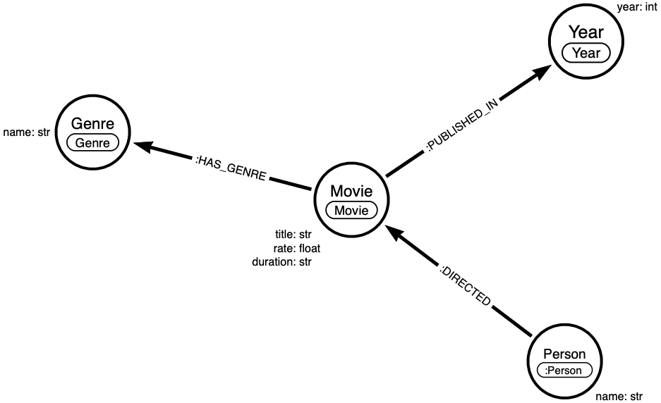

REMINDER:

1. Don't know if it will run on Mac M1, i used a large Ubuntu machine on AWS (almost 8Gb RAM).
2. If you try to change the other nodes (Director, Year, Genre) it won't update the other nodes (for now it can update only the movies because the idea is that we should have a collection per entity, and we miss those collections right now, but it's useful to help people understand that).
3. The model is coupled with the ObjectId contained inside Mongo (some events contain only the ObjectId to identify their document)

To start the demo, run:

```shell
# -d is for detached mode (runs everything in background)
docker compose up -d
```

After the environment is healthy (it usually takes around 2 minutes), you can run the following commands:

```shell
# Set the constraint inside our database
./createNeo4jConstraint.sh
```

```shell
# With this configuration we can produce data from Mongo 
./configMongoSourceConnector.sh
```

```shell
# With this configuration we can ingest data from Neo4j 
./configNeo4jSinkConnector.sh
```

```shell
# Lets create a new document  
docker exec mongo1 mongosh --eval "db.movies.insertOne({ title: 'Graph Adventure', year: '2022', director: 'Niels De Jong', duration: '3h 27min', genre: ['Adventure', 'Drama', 'Sci-Fi'], rate: '8' })"
```

```shell
# Now we should update the movie rating
# (it's not enough for a masterpiece like this)
docker exec mongo1 mongosh --eval "db.movies.updateOne({ title: 'Graph Adventure'},{\$set:{rate:'10',duration:'4h'}})"
```

```shell
# At the end, lets delete the node
docker exec mongo1 mongosh --eval "db.movies.deleteOne({ title: 'Graph Adventure'})"
```
 
Final Data Model:


